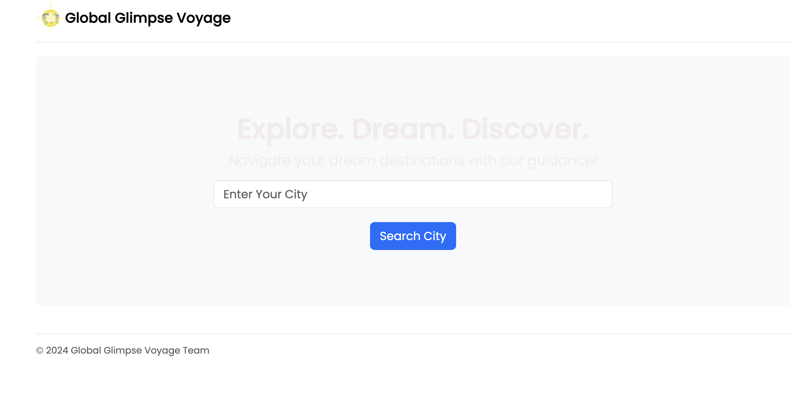
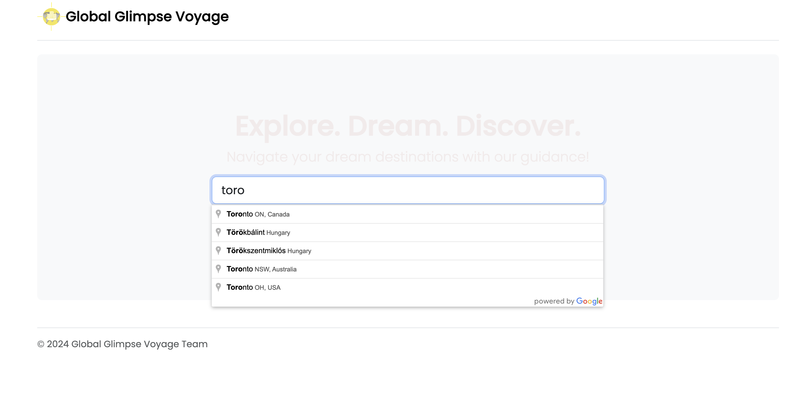
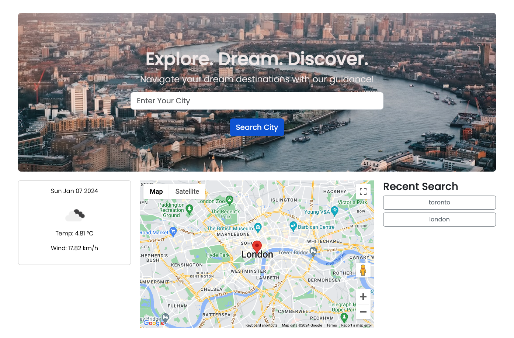
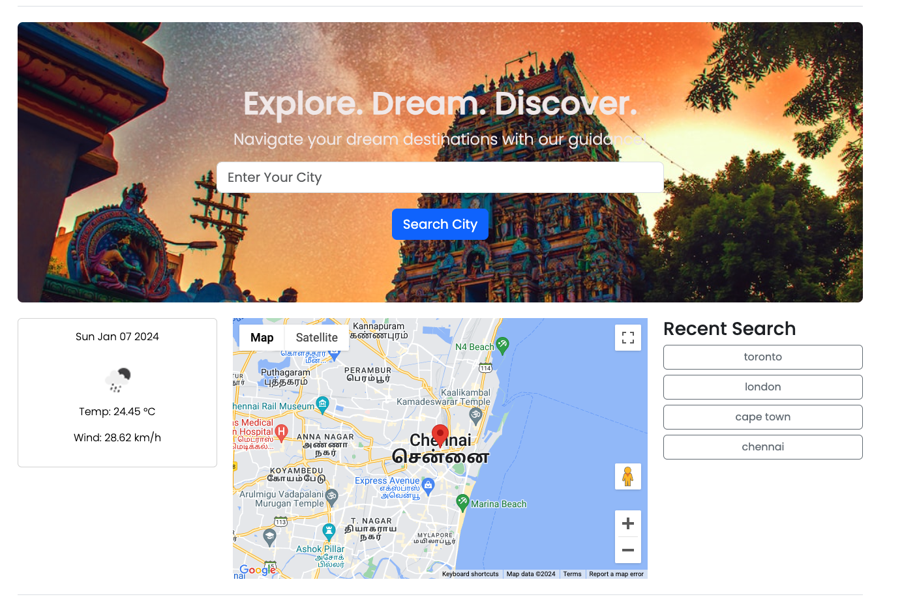
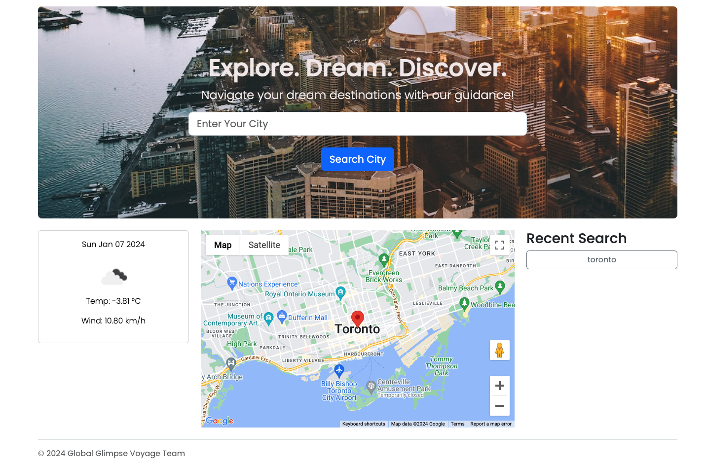

# Globle Glimpse Voyage

# Description

This is a comprehensive web application that assists users in planning their travels by providing detailed information on destinations, 
along with real-time weather updates. The app aims to be user-friendly, offering an intuitive interface that seamlessly combines travel 
planning and weather forecasting features.

## Installation

You don't need to install anything. You can open any browser on your computer or mobile device and navigate to the following link.

## Usage

To use this application, simply click the following link: 
From there you will be able view the application and use it by simply enter a city and click on search button.

# Link to deployed application

https://gah-mewbittik.github.io/SAM-Project-1/

## Credits

Andrew Biron
Maximillian Segar
Siva Ramachandran

## License

MIT License

Copyright (c) 2024 Global Glimpse Voyage Team

Permission is hereby granted, free of charge, to any person obtaining a copy of this software and associated documentation files (the "Software"), to deal in the Software without restriction, including without limitation the rights to use, copy, modify, merge, publish, distribute, sublicense, and/or sell copies of the Software, and to permit persons to whom the Software is furnished to do so, subject to the following conditions:

The above copyright notice and this permission notice shall be included in all copies or substantial portions of the Software.

THE SOFTWARE IS PROVIDED "AS IS", WITHOUT WARRANTY OF ANY KIND, EXPRESS OR IMPLIED, INCLUDING BUT NOT LIMITED TO THE WARRANTIES OF MERCHANTABILITY, FITNESS FOR A PARTICULAR PURPOSE AND NONINFRINGEMENT. IN NO EVENT SHALL THE AUTHORS OR COPYRIGHT HOLDERS BE LIABLE FOR ANY CLAIM, DAMAGES OR OTHER LIABILITY, WHETHER IN AN ACTION OF CONTRACT, TORT OR OTHERWISE, ARISING FROM, OUT OF OR IN CONNECTION WITH THE SOFTWARE OR THE USE OR OTHER DEALINGS IN THE SOFTWARE.
